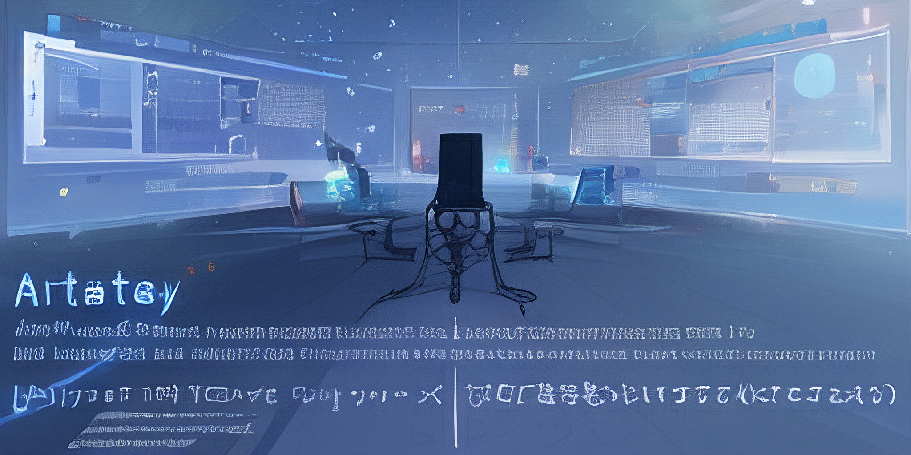

[English](README.md) | Русский

&nbsp;

&nbsp;

&nbsp;

# Artists learn Unity   

---

Проект по изучению [Unity](https://unity.com/).
Основан любителем из идеи помочь коллегам-художникам расширить свои возможности в [Unity](https://unity.com/) и самому научиться новому.

Любые замечания и предложения приветствуются.

---

- [Цели](part-0/goals.ru-RU.md)
- [Введение](part-0/part-0.ru-RU.md)
- [Часть 1](part-1/part-1.ru-RU.md)
- [Часть 2](part-2/part-2.ru-RU.md)
- [Часть 3](part-3/part-3.ru-RU.md)